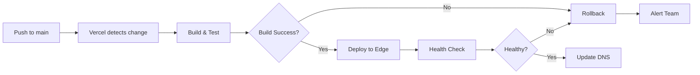

# Vercel Deployment Guide - Sepulki Forge UI

Complete guide for deploying the Sepulki Forge UI frontend to Vercel.

## 📋 Table of Contents

1. [Overview](#overview)
2. [Prerequisites](#prerequisites)
3. [Quick Start](#quick-start)
4. [Environment Variables](#environment-variables)
5. [Deployment Configuration](#deployment-configuration)
6. [Custom Domain Setup](#custom-domain-setup)
7. [Preview Deployments](#preview-deployments)
8. [Production Deployment](#production-deployment)
9. [Monitoring & Debugging](#monitoring--debugging)
10. [Optimization Tips](#optimization-tips)
11. [Troubleshooting](#troubleshooting)

---

## Overview

### What is Vercel?

Vercel is a cloud platform for static sites and serverless functions, optimized for Next.js applications. It provides:

- **Automatic deployments** from Git
- **Preview URLs** for every pull request
- **Edge caching** and CDN distribution
- **Serverless functions** for API routes
- **Zero-config** Next.js deployment
- **Custom domains** with automatic SSL

### Architecture

```
┌─────────────────────────────────────────────────────────┐
│                     Vercel Edge Network                  │
│                                                           │
│  ┌──────────────┐      ┌──────────────┐                │
│  │  Static      │      │  Serverless  │                │
│  │  Assets      │      │  Functions   │                │
│  │  (CDN)       │      │  (API Routes)│                │
│  └──────────────┘      └──────────────┘                │
└─────────────────────────────────────────────────────────┘
         │                        │
         │                        │
         ├────────────────────────┴──────────┐
         │                                    │
    ┌────▼─────┐                    ┌────────▼────────┐
    │  Browser │                    │  Hammer         │
    │  (Users) │                    │  Orchestrator   │
    └──────────┘                    │  (Backend API)  │
                                    └─────────────────┘
                                    │  Railway/Render │
                                    └─────────────────┘
```

---

## Prerequisites

### Required

- ✅ Vercel account ([sign up free](https://vercel.com/signup))
- ✅ GitHub repository with Sepulki code
- ✅ Deployed backend API (Hammer Orchestrator on Railway/Render)
- ✅ Node.js 18.18.0 or higher

### Optional

- GitHub/Google OAuth app credentials
- AWS S3 or MinIO for file storage
- Sentry account for error tracking
- Custom domain name

---

## Quick Start

### 1. Install Vercel CLI (Optional)

```bash
npm install -g vercel

# Login to Vercel
vercel login
```

### 2. Deploy via Vercel Dashboard (Recommended)

#### Step 1: Import Repository

1. Go to [Vercel Dashboard](https://vercel.com/dashboard)
2. Click **"Add New..."** → **"Project"**
3. Import your GitHub repository
4. Select the repository: `your-username/Sepulki`

#### Step 2: Configure Project

```
Framework Preset: Next.js
Root Directory: apps/forge-ui
Node.js Version: 18.x
Build Command: npm run build
Output Directory: .next (auto-detected)
Install Command: npm ci
```

#### Step 3: Environment Variables

Copy variables from `/apps/forge-ui/.env.vercel.example` to Vercel dashboard:

**Required Variables:**
```env
NEXTAUTH_URL=https://your-project.vercel.app
NEXTAUTH_SECRET=<generate-with-openssl>
NEXT_PUBLIC_GRAPHQL_ENDPOINT=https://your-backend.railway.app/graphql
NEXT_PUBLIC_ISAAC_SIM_IP=18.234.83.45
NEXT_PUBLIC_ISAAC_SIM_PORT=8211
```

#### Step 4: Deploy

Click **"Deploy"** and wait for the build to complete (2-3 minutes).

### 3. Deploy via CLI (Alternative)

```bash
# Navigate to forge-ui directory
cd apps/forge-ui

# Deploy to Vercel
vercel

# Follow prompts:
# - Link to existing project or create new
# - Set up project settings
# - Deploy to preview URL

# Deploy to production
vercel --prod
```

---

## Environment Variables

### Setting Environment Variables

#### Via Vercel Dashboard

1. Go to **Project Settings** → **Environment Variables**
2. Add variables for each environment:
   - **Production**: Live deployment
   - **Preview**: Pull request previews
   - **Development**: Local development with `vercel dev`

#### Via Vercel CLI

```bash
# Add production variable
vercel env add NEXTAUTH_SECRET production

# Add preview variable
vercel env add NEXTAUTH_SECRET preview

# Pull environment variables locally
vercel env pull .env.local
```

### Required Environment Variables

| Variable | Environment | Description |
|----------|-------------|-------------|
| `NEXTAUTH_URL` | Production, Preview | Full URL of deployment |
| `NEXTAUTH_SECRET` | All | JWT signing secret (32-char) |
| `NEXT_PUBLIC_GRAPHQL_ENDPOINT` | All | Backend GraphQL API URL |
| `NEXT_PUBLIC_ISAAC_SIM_IP` | All | Isaac Sim EC2 IP address |
| `NEXT_PUBLIC_ISAAC_SIM_PORT` | All | Isaac Sim WebSocket port |

### Optional but Recommended

| Variable | Purpose |
|----------|---------|
| `GITHUB_CLIENT_ID` | GitHub OAuth authentication |
| `GITHUB_CLIENT_SECRET` | GitHub OAuth authentication |
| `OPENAI_API_KEY` | AI-powered features |
| `NEXT_PUBLIC_SENTRY_DSN` | Error tracking |
| `AWS_ACCESS_KEY_ID` | S3 file storage |
| `AWS_SECRET_ACCESS_KEY` | S3 file storage |

### Generating Secrets

```bash
# Generate NEXTAUTH_SECRET
openssl rand -base64 32

# Generate API keys
openssl rand -hex 32
```

### Environment-Specific Configuration

```javascript
// Different values per environment
Production:  NEXT_PUBLIC_GRAPHQL_ENDPOINT=https://api.sepulki.com/graphql
Preview:     NEXT_PUBLIC_GRAPHQL_ENDPOINT=https://api-staging.sepulki.com/graphql
Development: NEXT_PUBLIC_GRAPHQL_ENDPOINT=http://localhost:4000/graphql
```

---

## Deployment Configuration

### vercel.json Configuration

The `apps/forge-ui/vercel.json` file configures deployment settings:

```json
{
  "version": 2,
  "framework": "nextjs",
  "regions": ["iad1"],
  "buildCommand": "npm run build",
  "installCommand": "npm ci",
  "outputDirectory": ".next"
}
```

### Key Configuration Options

#### Regions

```json
{
  "regions": ["iad1"]  // US East (Washington, D.C.)
}
```

Available regions:
- `iad1` - US East (recommended for US customers)
- `sfo1` - US West
- `cdg1` - Europe (Paris)
- `hnd1` - Asia (Tokyo)
- `all` - All regions (Enterprise only)

#### Functions Configuration

```json
{
  "functions": {
    "app/api/**/*.ts": {
      "memory": 1024,
      "maxDuration": 10
    }
  }
}
```

- **memory**: Function memory in MB (128-3008)
- **maxDuration**: Timeout in seconds (1-60 for Pro, 1-900 for Enterprise)

#### Build Configuration

```json
{
  "build": {
    "env": {
      "NEXT_PUBLIC_GRAPHQL_ENDPOINT": "@graphql-endpoint"
    }
  }
}
```

Use `@secret-name` to reference Vercel secrets.

### next.config.js Optimization

The configuration is already optimized for Vercel:

```javascript
module.exports = {
  // Production optimizations
  reactStrictMode: true,
  swcMinify: true,

  // Remove console logs in production
  compiler: {
    removeConsole: process.env.NODE_ENV === 'production' ? {
      exclude: ['error', 'warn']
    } : false
  },

  // Image optimization
  images: {
    formats: ['image/avif', 'image/webp'],
    minimumCacheTTL: 60
  }
}
```

---

## Custom Domain Setup

### Adding a Custom Domain

#### Via Vercel Dashboard

1. Go to **Project Settings** → **Domains**
2. Click **"Add Domain"**
3. Enter your domain: `forge.sepulki.com`
4. Follow DNS configuration instructions

#### DNS Configuration Options

**Option 1: CNAME (Subdomain)**
```
Type: CNAME
Name: forge
Value: cname.vercel-dns.com
```

**Option 2: A Record (Root Domain)**
```
Type: A
Name: @
Value: 76.76.21.21
```

**Option 3: Vercel Nameservers (Recommended)**
```
ns1.vercel-dns.com
ns2.vercel-dns.com
```

### SSL Certificate

Vercel automatically provisions SSL certificates via Let's Encrypt:

- **Automatic renewal** every 60 days
- **Wildcard support** for subdomains
- **No configuration** required

### Multiple Domains

```bash
# Add production domain
vercel domains add forge.sepulki.com

# Add www redirect
vercel domains add www.forge.sepulki.com

# Configure redirect in vercel.json
{
  "redirects": [
    {
      "source": "/:path*",
      "has": [{"type": "host", "value": "www.forge.sepulki.com"}],
      "destination": "https://forge.sepulki.com/:path*",
      "permanent": true
    }
  ]
}
```

### Update Environment Variables

After adding domain, update:

```env
NEXTAUTH_URL=https://forge.sepulki.com
NEXT_PUBLIC_ALLOWED_ORIGINS=https://forge.sepulki.com,https://www.forge.sepulki.com
```

---

## Preview Deployments

### How Preview Deployments Work

Every pull request automatically gets a unique preview URL:

```
https://sepulki-forge-pr-123-username.vercel.app
```

### Benefits

- ✅ **Test changes** before merging
- ✅ **Share with team** for review
- ✅ **Isolated environment** per PR
- ✅ **Automatic cleanup** after merge

### Configuration

Enable in `vercel.json`:

```json
{
  "github": {
    "enabled": true,
    "autoAlias": true,
    "autoJobCancelation": true,
    "silent": false
  }
}
```

### Environment Variables for Previews

Set preview-specific variables:

```env
# Preview environment uses staging backend
NEXT_PUBLIC_GRAPHQL_ENDPOINT=https://api-staging.sepulki.com/graphql
NEXTAUTH_URL=https://sepulki-forge-git-$VERCEL_GIT_COMMIT_REF.vercel.app
```

Use `$VERCEL_GIT_COMMIT_REF` to dynamically set URLs.

### Testing Preview Deployments

```bash
# 1. Create a new branch
git checkout -b feature/new-ui

# 2. Make changes and push
git add .
git commit -m "Add new UI feature"
git push origin feature/new-ui

# 3. Create pull request on GitHub
# Vercel automatically deploys preview

# 4. Check Vercel comment on PR for URL
# Visit preview URL to test changes

# 5. Merge PR when ready
# Preview deployment is automatically deleted
```

---

## Production Deployment

### Deployment Workflow



### Manual Production Deployment

```bash
# Deploy to production via CLI
vercel --prod

# Or via Git
git push origin main
```

### Deployment Triggers

Automatic deployments happen when:

1. **Pushing to main branch**
2. **Manually triggering** in Vercel dashboard
3. **Using Vercel CLI** with `--prod` flag

### Deployment Settings

Configure in **Project Settings** → **Git**:

```
Production Branch: main
Preview Branches: All branches
Ignored Build Step: None
```

### Pre-deployment Checks

Create `.github/workflows/vercel-deploy.yml`:

```yaml
name: Vercel Production Deployment

on:
  push:
    branches: [main]

jobs:
  deploy:
    runs-on: ubuntu-latest
    steps:
      - uses: actions/checkout@v4

      - name: Setup Node.js
        uses: actions/setup-node@v4
        with:
          node-version: '18'

      - name: Install dependencies
        run: |
          cd apps/forge-ui
          npm ci

      - name: Run tests
        run: |
          cd apps/forge-ui
          npm run test
          npm run lint

      - name: Build
        run: |
          cd apps/forge-ui
          npm run build

      - name: Deploy to Vercel
        uses: amondnet/vercel-action@v25
        with:
          vercel-token: ${{ secrets.VERCEL_TOKEN }}
          vercel-org-id: ${{ secrets.VERCEL_ORG_ID }}
          vercel-project-id: ${{ secrets.VERCEL_PROJECT_ID }}
          vercel-args: '--prod'
          working-directory: apps/forge-ui
```

### Rollback Strategy

If deployment fails:

```bash
# Via Dashboard
# Go to Deployments → Select previous working deployment → Promote to Production

# Via CLI
vercel rollback
```

---

## Monitoring & Debugging

### Vercel Analytics

Enable in **Project Settings** → **Analytics**:

- **Web Vitals**: Core Web Vitals tracking
- **Visitor insights**: Geographic distribution
- **Page performance**: Load times per route

### Real-time Logs

#### Via Dashboard

1. Go to **Project** → **Logs**
2. Filter by:
   - **Function**: Specific API routes
   - **Status**: Error codes
   - **Time range**: Last hour/day/week

#### Via CLI

```bash
# Stream production logs
vercel logs --follow

# Filter by function
vercel logs --filter=/api/graphql

# Show errors only
vercel logs --filter="status:500"
```

### Error Tracking with Sentry

Configure Sentry in `apps/forge-ui/sentry.config.js`:

```javascript
import * as Sentry from '@sentry/nextjs'

Sentry.init({
  dsn: process.env.NEXT_PUBLIC_SENTRY_DSN,
  environment: process.env.VERCEL_ENV,
  tracesSampleRate: 0.1,

  // Attach source maps
  integrations: [
    new Sentry.BrowserTracing({
      tracePropagationTargets: ['localhost', /^https:\/\/.*\.vercel\.app/]
    })
  ]
})
```

Add environment variable:

```env
NEXT_PUBLIC_SENTRY_DSN=https://your-sentry-dsn@sentry.io/project-id
SENTRY_AUTH_TOKEN=your-auth-token
```

### Performance Monitoring

Check **Deployments** → **Analytics** for:

- **TTFB**: Time to First Byte
- **FCP**: First Contentful Paint
- **LCP**: Largest Contentful Paint
- **CLS**: Cumulative Layout Shift
- **FID**: First Input Delay

### Health Checks

Create health check endpoint in `apps/forge-ui/src/app/api/health/route.ts`:

```typescript
import { NextResponse } from 'next/server'

export async function GET() {
  try {
    // Check backend connectivity
    const response = await fetch(process.env.NEXT_PUBLIC_GRAPHQL_ENDPOINT!, {
      method: 'POST',
      headers: { 'Content-Type': 'application/json' },
      body: JSON.stringify({ query: '{ __typename }' })
    })

    if (!response.ok) throw new Error('Backend unreachable')

    return NextResponse.json({
      status: 'healthy',
      backend: 'connected',
      timestamp: new Date().toISOString()
    })
  } catch (error) {
    return NextResponse.json(
      { status: 'unhealthy', error: error.message },
      { status: 503 }
    )
  }
}
```

Monitor at: `https://your-domain.vercel.app/api/health`

---

## Optimization Tips

### Build Performance

#### 1. Enable SWC Minification

```javascript
// next.config.js
module.exports = {
  swcMinify: true,  // Faster than Terser
}
```

#### 2. Optimize Dependencies

```bash
# Analyze bundle size
npm run build
# Check .next/analyze/client.html

# Use dynamic imports for heavy libraries
const ThreeViewer = dynamic(() => import('@/components/ThreeViewer'), {
  ssr: false,
  loading: () => <div>Loading 3D viewer...</div>
})
```

#### 3. Enable Incremental Static Regeneration

```typescript
// For pages that don't change often
export const revalidate = 3600  // Revalidate every hour
```

### Runtime Performance

#### 1. Image Optimization

```typescript
import Image from 'next/image'

<Image
  src="/robot.png"
  alt="Robot"
  width={500}
  height={300}
  priority  // For above-fold images
  placeholder="blur"
  blurDataURL="data:image/jpeg;base64,..."
/>
```

#### 2. Font Optimization

```typescript
import { Inter } from 'next/font/google'

const inter = Inter({
  subsets: ['latin'],
  display: 'swap',
  variable: '--font-inter'
})
```

#### 3. Edge Caching

Add cache headers in `vercel.json`:

```json
{
  "headers": [
    {
      "source": "/static/:path*",
      "headers": [
        {
          "key": "Cache-Control",
          "value": "public, max-age=31536000, immutable"
        }
      ]
    }
  ]
}
```

### Cost Optimization

#### 1. Reduce Function Invocations

- Use static generation where possible
- Implement client-side caching
- Batch API requests

#### 2. Optimize Build Minutes

```json
{
  "ignoreCommand": "git diff --quiet HEAD^ HEAD ./apps/forge-ui"
}
```

Only build when forge-ui changes.

#### 3. Monitor Usage

Check **Account** → **Usage** for:
- Bandwidth
- Function invocations
- Build minutes
- Edge requests

---

## Troubleshooting

### Common Issues

#### 1. Build Fails with "Module not found"

**Cause**: Missing dependencies or incorrect import paths

**Solution**:
```bash
# Clear node_modules and reinstall
cd apps/forge-ui
rm -rf node_modules .next
npm ci
npm run build
```

#### 2. Environment Variables Not Working

**Cause**: Not set in correct environment or missing `NEXT_PUBLIC_` prefix

**Solution**:
```bash
# Check current variables
vercel env ls

# Pull variables locally
vercel env pull .env.local

# Verify NEXT_PUBLIC_ prefix for client-side variables
# Server-only variables should NOT have this prefix
```

#### 3. API Calls Failing (CORS)

**Cause**: Backend not allowing Vercel domain

**Solution**:
Add Vercel URLs to backend CORS config:

```javascript
// Backend (Hammer Orchestrator)
const corsOptions = {
  origin: [
    'https://your-project.vercel.app',
    'https://*.vercel.app',  // All preview deployments
    'https://forge.sepulki.com'
  ],
  credentials: true
}
```

#### 4. Authentication Not Working

**Cause**: NEXTAUTH_URL mismatch or callback URL incorrect

**Solution**:
```env
# Must match exact deployment URL
NEXTAUTH_URL=https://your-project.vercel.app

# Update OAuth callback URLs:
# GitHub: https://github.com/settings/applications
# Callback: https://your-project.vercel.app/api/auth/callback/github
```

#### 5. WebSocket Connection Fails

**Cause**: Using `ws://` instead of `wss://` in production

**Solution**:
```typescript
const wsUrl = process.env.NODE_ENV === 'production'
  ? 'wss://api.sepulki.com/graphql'  // Use wss:// for production
  : 'ws://localhost:4000/graphql'
```

#### 6. Large Bundle Size

**Cause**: Importing entire libraries or missing code splitting

**Solution**:
```typescript
// ❌ Bad: Imports entire library
import _ from 'lodash'

// ✅ Good: Import specific functions
import debounce from 'lodash/debounce'

// ✅ Good: Dynamic import for heavy components
const HeavyComponent = dynamic(() => import('./HeavyComponent'), {
  ssr: false
})
```

#### 7. Slow Build Times

**Cause**: Rebuilding dependencies or no caching

**Solution**:
```json
// vercel.json - Enable build cache
{
  "github": {
    "autoJobCancelation": true
  }
}
```

```bash
# Use npm ci instead of npm install
npm ci
```

### Debug Mode

Enable verbose logging:

```env
# .env.local
DEBUG=vercel:*
NEXT_PUBLIC_DEBUG_MODE=true
```

### Getting Help

1. **Vercel Docs**: https://vercel.com/docs
2. **Support**: support@vercel.com
3. **Community**: https://github.com/vercel/vercel/discussions
4. **Status**: https://vercel-status.com

---

## Performance Benchmarks

### Target Metrics

| Metric | Target | Vercel Result |
|--------|--------|---------------|
| TTFB | < 200ms | ~100ms (Edge) |
| FCP | < 1.5s | ~800ms |
| LCP | < 2.5s | ~1.2s |
| Build Time | < 3min | ~2min |
| Cold Start | < 1s | ~300ms |

### Optimization Checklist

- ✅ Enable SWC minification
- ✅ Use Next.js Image component
- ✅ Implement font optimization
- ✅ Enable incremental static regeneration
- ✅ Use dynamic imports for heavy components
- ✅ Optimize third-party scripts
- ✅ Enable edge caching
- ✅ Minimize bundle size
- ✅ Implement code splitting
- ✅ Use server components where possible

---

## Security Best Practices

### 1. Environment Variables

- ✅ Never commit secrets to Git
- ✅ Use different secrets per environment
- ✅ Rotate secrets regularly
- ✅ Use `NEXT_PUBLIC_` only for public data
- ✅ Store sensitive data server-side

### 2. Content Security Policy

Already configured in `next.config.js`:

```javascript
const cspHeader = `
  default-src 'self';
  script-src 'self' 'unsafe-inline' 'unsafe-eval';
  style-src 'self' 'unsafe-inline';
  img-src 'self' data: https: blob:;
  connect-src 'self' https://api.sepulki.com wss://api.sepulki.com;
`
```

### 3. Authentication

- ✅ Use NextAuth.js for OAuth
- ✅ Implement CSRF protection
- ✅ Enable secure cookies
- ✅ Use HTTPS only in production
- ✅ Implement rate limiting

### 4. Rate Limiting

Create middleware in `apps/forge-ui/src/middleware.ts`:

```typescript
import { NextResponse } from 'next/server'
import type { NextRequest } from 'next/server'

const rateLimit = new Map<string, { count: number; resetAt: number }>()

export function middleware(request: NextRequest) {
  const ip = request.ip || 'unknown'
  const now = Date.now()
  const limit = rateLimit.get(ip)

  if (limit && now < limit.resetAt) {
    if (limit.count >= 100) {
      return new NextResponse('Too Many Requests', { status: 429 })
    }
    limit.count++
  } else {
    rateLimit.set(ip, { count: 1, resetAt: now + 60000 })
  }

  return NextResponse.next()
}

export const config = {
  matcher: '/api/:path*'
}
```

---

## Next Steps

After successful deployment:

1. ✅ **Monitor** performance and errors
2. ✅ **Set up alerts** for downtime
3. ✅ **Configure** custom domain
4. ✅ **Enable** analytics
5. ✅ **Implement** CI/CD pipeline
6. ✅ **Document** deployment process
7. ✅ **Train team** on Vercel workflow
8. ✅ **Plan** scaling strategy

---

## Additional Resources

- 📚 [Vercel Documentation](https://vercel.com/docs)
- 📚 [Next.js Documentation](https://nextjs.org/docs)
- 📚 [NextAuth.js Documentation](https://next-auth.js.org)
- 📚 [Vercel Examples](https://github.com/vercel/examples)
- 📚 [Sepulki Deployment Platforms](./DEPLOYMENT_PLATFORMS.md)

---

**Questions?** Contact the Sepulki team or refer to the main documentation.

**Last Updated**: 2025-11-04
